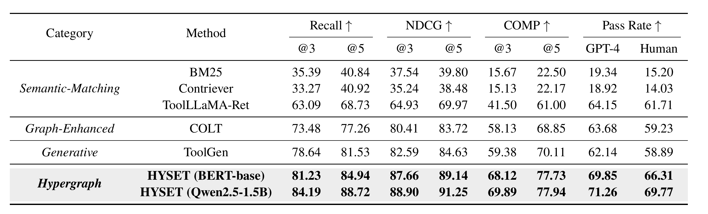

<div align="center">

# HYSET

<p><em>Tools Are Not Islands: Set-Level Tool Retrieval for LLM Agents via Query-Conditioned Hyperedge Prediction</em></p>

<!-- Placeholders currently pointing at this repository. Replace when live.
     arXiv    https://arxiv.org/abs/<id>            and swap "coming soon" for the id
     Model    https://huggingface.co/<user>/<repo>  and swap "coming soon" for the name
     X        https://x.com/<handle>
     RedNote  the RedNote profile or post URL
     WeChat   the article or QR-code page URL                                          -->

[](https://stormwther18-hyset-demo.hf.space)
[](https://github.com/stormwther18/HYSET)
[](https://github.com/stormwther18/HYSET)
[](./LICENSE)
[](https://www.python.org/)
[](https://github.com/stormwther18/HYSET)

[](https://github.com/stormwther18/HYSET)
[](https://github.com/stormwther18/HYSET)
[](https://github.com/stormwther18/HYSET)


</div>

An LLM agent with thousands of available APIs cannot fit them all into one prompt, so a retriever has to shortlist tools before the agent starts reasoning. HYSET retrieves a tool set instead of a ranked list of tools. It reads every candidate set as a hyperedge on a tool co-invocation hypergraph and scores that set as a whole, conditioned on the query.

<br>

## 📰 News

- **2026-07-25** First public release. Code, the 13,860 tool corpus, and the six official ToolBench test splits are all in this repository.
- **2026-08-01** The arXiv preprint.

<br>

## 🧩 Why Set-Level Retrieval

Real tasks rarely need a single API. A query is usually resolved by several APIs invoked together, so what a retriever should hand to the agent is a jointly useful set, not a ranked list.

However, most existing retrievers score every tool on its own. That is where the information is lost, because whether a tool helps often depends on which other tools arrive with it.

> Example: A travel request needs `SearchFlights`, `SearchHotel`, and `SearchWeather` working together. Independent scoring will happily return `SearchFlights`, `SearchFlightsLowCost`, and `FlightStatusTracker` instead. Each one looks travel relevant. The three of them together are useless.

[How HYSET Works](#-how-hyset-works) turns this observation into a scoring problem over sets.

<br>

## 🏗️ How HYSET Works

HYSET scores a candidate set `E` against a query `x` with two terms that simply add up.

```
F(x, E) = F_set(E) + F_align(x, E)
```

`F_set` reads the set as a hyperedge and sums the interaction of every tool pair inside it, through a matrix that belongs to that particular set size. The same pair of tools can therefore count differently in a set of two and in a set of four. `F_align` is a query conditioned attention over the tools in the set, so a tool that matches the query well lifts the whole set.

The figure at the top of this page shows both terms together with the reward path used during training. The full formulation lives in [`docs/method.md`](docs/method.md).

<br>

## 📊 Results

Numbers reported in the paper on ToolBench, measured over the six official held out test splits and 600 queries in total.

<div align="center">

</div>

The widest margins land on COMP, which counts a query as solved only when every ground truth tool has been recovered. That is exactly the quantity set-level scoring is built to improve, and the gain carries through to the agent as a higher Pass Rate. To regenerate these numbers see [Reproducing the Paper](#-reproducing-the-paper).

<br>

## 🚀 Quick Start

```bash
git clone --recurse-submodules https://github.com/stormwther18/HYSET.git
cd HYSET
python -m venv .venv
source .venv/bin/activate
pip install -r requirements.txt
```

The checkpoint and the query encoder are too large to ship here. See [Data & Checkpoints](#-data--checkpoints) for where they live, then run one retrieval.

```bash
python scripts/smoketest_load.py \
    --ckpt    /path/to/best.pt \
    --encoder /path/to/ToolGen-Qwen2.5-1.5B-Tool-Retriever \
    --device  cuda
```

This loads the checkpoint, runs a single query, and prints the tool set it selected. The three paths can also come from `HYSET_CHECKPOINT_PATH`, `HYSET_ENCODER_PATH`, and `HYSET_DEVICE`, so copying `.env.example` to `.env` is a reasonable starting point.

<br>

## 🔬 Reproducing the Paper

Each stage has its own entry point and they are meant to run in this order.

```bash
bash HYSET.sh                            # build the corpus and the training data
python src/precompute_hard_negatives.py  # cache hard negatives for the retrieval loss
python src/precompute_rewards.py         # cache execution rewards for the self-training loss
bash train_hyset.sh                      # train
bash inference_hyset.sh                  # retrieve on the six test splits
python src/evaluate_hyset.py             # offline metrics
python src/aggregate_results.py          # result tables
bash baselines_retrieval.sh              # baselines
python src/evaluate_baselines.py
```

Note that the raw ToolBench instructions and answers are not redistributed here, so fetch them first as described in [Data & Checkpoints](#-data--checkpoints).

<br>

## 📦 Data & Checkpoints

| Artifact | Size | Where it lives |
|---|---|---|
| `data/hyset_corpus.json`, the 13,860 tool corpus | 19 MB | this repository |
| the six ToolBench test query split lists | 1 MB | this repository |
| trained checkpoint `best.pt` | 6.5 GB | Hugging Face|
| query encoder `ToolGen-Qwen2.5-1.5B-Tool-Retriever` | 3 GB | Hugging Face|
| raw ToolBench instructions, answers, and tool environment | 2.1 GB | not redistributed, download from [OpenBMB/ToolBench](https://github.com/OpenBMB/ToolBench) |
| ToolBench and StableToolBench source | 480 MB | git submodules under `external/` |

<br>

## 🙏 Acknowledgements

HYSET stands on [ToolBench](https://github.com/OpenBMB/ToolBench), which supplies the tool library, the training queries, and the evaluation protocol, and on [StableToolBench](https://github.com/THUNLP-MT/StableToolBench) for the stable execution environment used in the end to end runs. We thank the authors of all of them for releasing their work.

<br>

## 📚 Citation

```bibtex
@misc{hong2026hyset,
  title={Tools Are Not Islands: Set-Level Tool Retrieval for LLM Agents via Query-Conditioned Hyperedge Prediction},
  author={Hong, Xinyi and Dong, Pinjun and Yu, Xinyang and Jiang, Binyan},
  year={2026},
  note={Preprint}
}
```

<br>

## 📄 License

The source code in this repository is released under the [MIT License](./LICENSE). The submodules under `external/` keep their own upstream licenses. `data/hyset_corpus.json` is derived from ToolBench and stays subject to ToolBench's terms. Model weights will carry a research-use license documented on their model card.
